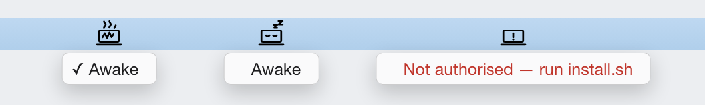

# lidkeeper

Stop your Mac sleeping — **including when the lid is closed** — from a single
menu bar icon.



macOS sleeps when you close the lid. `caffeinate` does **not** prevent this: it
only blocks *idle* sleep, while lid-close sleep goes down a different path.
Apple's supported way around it (clamshell mode) needs an external display plus
external keyboard/mouse. The only thing that actually works on a bare laptop is
`pmset disablesleep`, which needs root — so it usually lives in a terminal
command you have to remember, with no indication of whether it's on.

lidkeeper puts that switch in the menu bar, with an icon that tells you the
state at a glance.

## Install

```sh
git clone https://github.com/kxfeng/lidkeeper.git
cd lidkeeper
./install.sh
```

The installer asks for your password once, to write the sudoers rule. Requires
[SwiftBar](https://swiftbar.app) — it offers to install it via Homebrew if
missing.

## Update

```sh
git pull && ./install.sh
```

`install.sh` is idempotent — re-running it overwrites the plugin and icons in
place and leaves the sudoers rule alone if it is already correct.

## Uninstall

```sh
./uninstall.sh
```

This **clears the lid-awake state before removing anything**, so you are never
left with `disablesleep=1` and no icon to tell you about it.

## How it works

The plugin flips exactly one setting:

```sh
pmset -a disablesleep 0|1
```

`-a` covers every power source, so it works on battery too — not just plugged
in. No other power setting is read, modified, or written: your `sleep`,
`displaysleep`, `hibernatemode` and the rest are never touched.

**Scope: this is a system-wide sleep kill switch, not a lid-only one.** While it
is on, the machine will not idle-sleep either — leaving the lid open and walking
away no longer puts it to sleep. The lid is what makes this tool worth having
(`caffeinate` already blocks idle sleep and cannot survive a lid close), but the
underlying switch is broader than the lid. The display still sleeps on its own
schedule; only system sleep is suppressed.

### Icons

| Icon | State |
|---|---|
| Laptop with rising smoke | Awake — system sleep suppressed |
| Laptop dozing, Zzz | System default — normal sleep behaviour |
| Laptop with an exclamation | Not authorised (sudoers rule missing) |

The third state matters: without it, an unauthorised install would show the
"dozing" icon and you would think the toggle was simply off, when in fact
clicking it does nothing.

The README figure is generated too — `docs/build.sh` renders `docs/states.html`
into `docs/states.png`, so the screenshot cannot drift from the real menu
wording without someone noticing.

Icons are passed to SwiftBar as `templateImage=`, not `image=`. A template
image is tinted by macOS from its alpha channel to match the menu bar, so one
black-on-transparent PNG renders black in light mode and white in dark mode.
Passing it as `image=` instead paints the literal pixels, leaving a black icon
that is nearly invisible on a dark menu bar. The SVG sources are therefore pure
black with transparency, and must stay that way — colour in the source would
survive as a flat silhouette.

Icons are SVG sources rasterised to PNG by `icons/build.sh`. The build tags
them **144 DPI** — SwiftBar renders an `image=` payload at one point per pixel,
so an untagged 44px icon is drawn twice too tall and gets clipped by the menu
bar. Tagging it as @2x yields 44 pixels at 22 points: correct size, Retina
sharpness.

## If SwiftBar crashes

The state is **not** held by this software. `pmset disablesleep` sets IOKit's
`SleepDisabled` property on `IOPMrootDomain`, which is system-wide and survives
SwiftBar crashing, quitting, or being uninstalled. The plugin reads it fresh on
every refresh and caches nothing, so a restarted SwiftBar always shows the true
state — there is no stale-UI window.

That cuts both ways: if SwiftBar dies while the lid-awake mode is on, the mode
stays on and you have lost your only indicator. Three ways to check without it:

```sh
lidkeeper doctor          # state + whether the menu bar app is alive + install health
lidkeeper status          # just the value: 1 = lid stays awake, 0 = default
open -a SwiftBar          # bring the icon back

ioreg -n IOPMrootDomain -r -d 1 | grep SleepDisabled   # ground truth, no install needed
```

`lidkeeper doctor` is the one to reach for when the icon has vanished — it tells
you the real state regardless, and whether SwiftBar is the thing that died.

### Autostart

`install.sh` sets SwiftBar's `SwiftBarLaunchAtLogin` preference, but that key
alone is not proof the app registered itself as a login item — SwiftBar may only
call `SMAppService` when you flip the switch in its own Preferences. Verify in
**System Settings → General → Login Items**.

There is no crash auto-restart. If SwiftBar dies, `open -a SwiftBar` brings it
back, and the toggle state is unaffected either way.

### Getting SwiftBar's own menu back

This plugin hides SwiftBar's icon and its per-plugin submenu, so the app has no
visible Preferences entry. To restore it temporarily:

```sh
defaults write com.ameba.SwiftBar HideSwiftBarIcon -bool false
pkill -x SwiftBar && open -a SwiftBar
```

The `ioreg` line is the ground truth — it needs nothing installed and works even
if this repo is gone.

Note that `disablesleep` does **not** appear in `pmset -g`, `-g custom` or
`-g live`; pmset accepts the key but never echoes it back. Reading state from
pmset output silently always returns 0. IOKit is the only reliable source.

A launchd `KeepAlive` agent could auto-restart SwiftBar, but it is deliberately
not shipped here: it would also prevent you from ever quitting SwiftBar
intentionally, and the state is already verifiable without it.

## Security

The sudoers rule grants two exact command lines and nothing else:

```
<you> ALL=(root) NOPASSWD: /usr/bin/pmset -a disablesleep 0
<you> ALL=(root) NOPASSWD: /usr/bin/pmset -a disablesleep 1
```

This is not blanket access to `pmset` — no other power setting is reachable
through it, and no other command is granted. The installer validates the file
with `visudo -c` before installing it; a malformed sudoers file can lock you
out of `sudo` entirely.

The file is installed as `/etc/sudoers.d/lidkeeper`, deliberately **without a
file extension**: `sudo` silently skips any file in `sudoers.d` whose name
contains a `.` or ends in `~` (see `man sudoers`). Naming it `lidkeeper.sudoers`
would install cleanly and never take effect.

## Caveats

**It does not time out.** The setting stays on until something turns it off.
Sources differ on whether it survives a reboot and I could not verify it — the
value has no visible on-disk home (`com.apple.PowerManagement.plist` does not
exist on macOS 26, and it is not in NVRAM), which suggests runtime-only, but
several write-ups claim it persists. **Assume it persists.** After your next
reboot, run `lidkeeper doctor` to find out for your own machine. A Mac left with
this on will keep draining in a bag.

**Heat.** A closed laptop dissipates heat poorly. Running a sustained heavy load
with the lid shut will thermally throttle the machine. Fine for a long download;
think twice about an overnight compile.

**Menu bar space.** On notched MacBooks the notch splits the menu bar and status
items cannot occupy it. If your menu bar is already crowded, icons pushed toward
the notch silently disappear — that's macOS, not this plugin.

## Requirements

- macOS (tested on 26.x, Apple Silicon)
- [SwiftBar](https://swiftbar.app)
- Google Chrome — only to rebuild icons from SVG (`icons/build.sh`); not needed
  to install or run

## License

MIT
